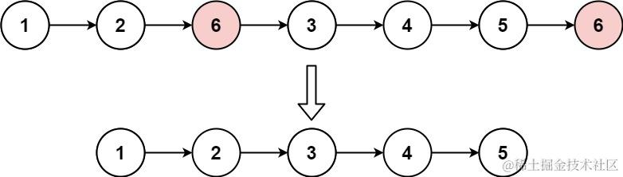

# [203. 移除链表元素](https://leetcode.cn/problems/remove-linked-list-elements/)

给你一个链表的头节点 `head` 和一个整数 `val` ，请你删除链表中所有满足 `Node.val == val` 的节点，并返回 **新的头节点** 。

**示例 1：**



```js
输入： head = [1,2,6,3,4,5,6], val = 6
输出： [1,2,3,4,5]
```

**示例 2：**

```js
输入： head = [], val = 1
输出： []
```

**示例 3：**

```js
输入： head = [7,7,7,7], val = 7
输出： []
```

## 思路

- 删除很简单，直接把next 指向next.next
- 注意点在于 采用虚拟头结点的方式，这样移除第一个节点也不会出错

```js
var removeElements = function(head, val) {
    let dummyHead = new ListNode(0,head);
    let cur = dummyHead;
    while(cur.next){
        if(cur.next.val === val){
            cur.next = cur.next.next
        }else{
            cur = cur.next
        }
    }
    return dummyHead.next
};
```
