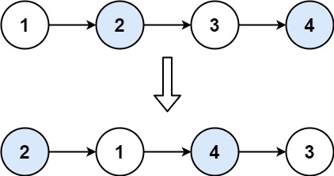

# [24. 两两交换链表中的节点](https://leetcode.cn/problems/swap-nodes-in-pairs/)

给你一个链表，两两交换其中相邻的节点，并返回交换后链表的头节点。你必须在不修改节点内部的值的情况下完成本题（即，只能进行节点交换）。

**示例 1：**



```js
输入： head = [1,2,3,4]
输出： [2,1,4,3]
```

**示例 2：**

```js
输入： head = []
输出： []
```

**示例 3：**

```js
输入： head = [1]
输出： [1]
```

## 思路

- 此题思路和反转链表思路相似，但不同点在于要一次反转两个节点，所以要两个temp记录断开的节点
- 并且反转后需要跳两步进行下一次两两反转

```js
var swapPairs = function(head) {
    let dummyHead = new ListNode(0,head);
    let cur = dummyHead
    while(cur.next&& cur.next.next){
        // 记录node1和node3
        let temp = cur.next,temp1 = cur.next.next.next;
        // cur指向第二个节点
        cur.next = cur.next.next
        // 第二个节点指向原链表第一个节点
        cur.next.next = temp;
        // 原第一个节点指向第三个节点，实现反转
        temp.next = temp1;
        // 维护cur
        cur = cur.next.next
    }
    return dummyHead.next
};
```
