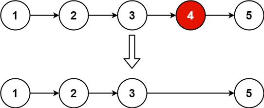

# [19. 删除链表的倒数第 N 个结点](https://leetcode.cn/problems/remove-nth-node-from-end-of-list/)

提示

给你一个链表，删除链表的倒数第 `n` **个结点，并且返回链表的头结点。

**示例 1：**



```js
输入： head = [1,2,3,4,5], n = 2
输出： [1,2,3,5]
```

**示例 2：**

```js
输入： head = [1], n = 1
输出： []
```

**示例 3：**

```js
输入： head = [1,2], n = 1
输出： [1]
```

## 思路

- 难点在于怎么找到倒数n
- 定义虚拟头结点dummyHead（删除链表统一操作
- 定义fast,slow快慢指针=dummyHead，先让fast先走n步
- 再让fast,slow一起走，直到fast走到终点，此时slow则走到n-1的位置（操作删除的前节点，删除链表的统一操作
- 此时进行删除操作就是删除倒数N节点

```js
var removeNthFromEnd = function(head, n) {
    let dummyHead = new ListNode(0,head)
    // 定义快慢节点从表头的前一个节点开始
    let fast = slow = dummyHead
    // 让快节点先走n步
    while(n--){
        fast = fast.next
    }
    /*
    快慢节点一起走 此时fast走到最后一个节点，
    则slow走到n的前一个节点
    */ 
    while(fast.next !== null){
        fast = fast.next
        slow = slow.next
    }
    slow.next = slow.next.next
    return dummyHead.next
};
```
