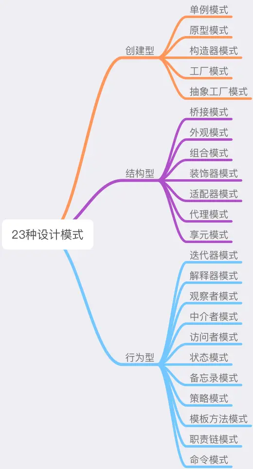

# 设计模式的学习之道

## SOLID设计原则

- 单一功能原则（Single Responsibility Principle）
- 开放封闭原则（Opened Closed Principle）
- 里式替换原则（Liskov Substitution Principle）
- 接口隔离原则（Interface Segregation Principle）
- 依赖反转原则（Dependency Inversion Principle）

## 设计模式的核心思想——封装变化

将这个变化造成的影响最小化 —— 将变与不变分离，确保变化的部分灵活、不变的部分稳定。

## 设计模式的“术”

