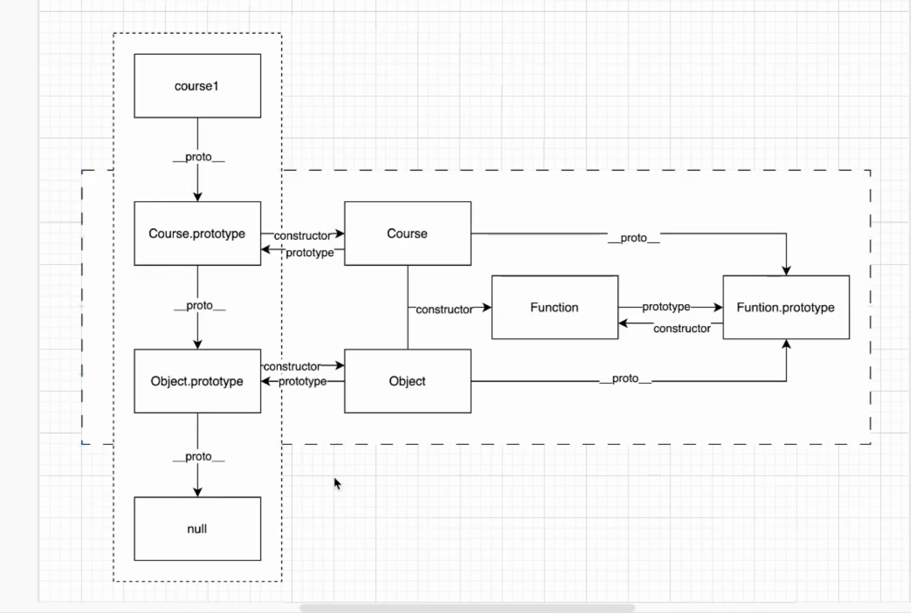

#

## 面向对象

### 对象是什么 为什么要面向对象 面向对象的优势？ => 简化了我们对于流程的岔路准备

### 特点： 逻辑迁移更加灵活、代码复用性更高、高度模块化的提现

- 模块 + 接口 = 对象

```js
new Vue()

App.vue
table.

// 在.vue文件里面能够使用vue相关语法就实际上使用了vue对象
```

### 对象的理解

- 对象对单个物体的简单抽象 => 对象产生关联
- 对象是基础，对象也是容器 => 属性、方法、对象

```js
    //简单对象，js中最常用的
    const Coures = {

    }
    // 函数对象
    function Coures(){
        this.teacher = 'yy'
        this.class = 'oop'
        this.startCourse = function(name){
            return `'开始${name}'课程`
        }
    }

    const course1 = new Course()
    //构造实例的函数对象 => 构造函数 =? 严谨化构建一个对象
    // => ES => class  
    // new 指向实例 也就是course1
```

## 构造函数 - 生成对象

### 需要一个模板

### 类即对象模板

### js对象本质不是基于类，基于构造函数 + 原型链的传递方式 => constroctor + prototype (重点，js面向对象的本质)

### 追问1

#### new的过程发生了什么？ new 原理

```js
    function Course(){}
    const course = new Course()
```

- 1. 结构上：创建了一个空对象，用于承载返回的对象实例
- 2. 属性上：生成的空对象的原型对象指向了构造函数的prototype属性
- 3. 关系上：将当前实例对象赋给了内部的this
- 4. 生命周期上：执行了构造函数的初始化代码

### 追问：实例化生成的对象彼此之间有没有联系 -独立的，没有联系

### 追问：constructor她的存在意义？是什么？=> 构造一类物品的模板

- 1. 每个实例对象被创建时，会自动拥有一个证明身份的constructor
- 2. constructor来源于原型对象，指向了构造函数的引用

#### 实例获得类的属性 => 继承了类的属性

### 追问3：使用构造函数生成对象有什么问题吗？ 会有性能问题吗 => 如何优化，原型对象是什么

### 原型对象

- 每个实例都具备一个constructor
- constructor & 继承属性 来自于new => 形成了属性传递的链条
- 子类上生成__proto__ ，将.prototype放入 => 原型链



#### 回答追问

- 原型链传递的原理 => Course.prototype =>即为继承

```js
    function Course(){}
    Course.prototype.startCourse = function(name){

    }
    const course = new Course()
```

## 继承

### 实现继承 => 在原型对象中的属性方法可以被孩子们继承

```js
    function Game(){
        this.name = 'LOL'
    }
    Game.prototype.getName() = function(){
        return this.name
    }

    function LOL(){}
    LOL.prototype = new Game()
    LOL.prototype.constructor = LOL
    const lol = new LOL()
    lol.getGame()
```

#### 追问： 重写原型的方式有什么缺点

- 1. 父类属性一旦赋予给子类的原型属性，此时就属于子类实例共享了 - 继承者的实例间互相篡改
- 2. 实例化时，无法传承

### 解决方法：构造函数继承 - 构造函数内部使用

```js
     function Game(){
        this.name = 'LOL'
    }
    Game.prototype.getName() = function(){
        return this.name
    }

    function LOL(arg){
        Game.call(this, arg)
    }
    const lol = new LOL()
    lol.getGame()
    //解决共享属性问题 + 传参问题
```

### 追问： 这样的话原型链上的共享方法就无法读取继承了 - 组合继承

```js
 function Game(){
        this.name = 'LOL'
    }
    Game.prototype.getName() = function(){
        return this.name
    }

   function LOL(arg){
        Game.call(this, arg)
    }
    LOL.prototype = new Game()
    LOL.prototype.constructor = LOL
    const lol = new LOL()
    lol.getGame()
```

### 追问：父类的构造函数会执行两遍怎么办 -寄生组合继承

```js
 function Game(){
        this.name = 'LOL'
    }
    Game.prototype.getName() = function(){
        return this.name
    }

   function LOL(arg){
        Game.call(this, arg)
    }
    LOL.prototype = Object.create(Game.prototype)
    LOL.prototype.constructor = LOL

    const lol = new LOL()
    lol.getGame()
```

### 追问： 多重继承？

```js
    function Game(){
        this.name = 'LOL'
    }
    Game.prototype.getName() = function(){
        return this.name
    }
    function Store(){
        this.name = 'epic'
    }
    Store.prototype.getPlatform() = function(){
        return this.shop
    }

   function LOL(arg){
        Game.call(this, arg)
        Store.call(this, arg)
    }
    LOL.prototype = Object.create(Game.prototype)
    //优先级
    Object.assign(Game.prototype, Store.prototype)
    LOL.prototype.constructor = LOL

    const lol = new LOL()
    lol.getGame()
```

### 拔高

对象 => 模块
闭包 => 突破作用域

=> 隔离 + 和外部联系的桥梁

#### 如何实现一个私有变量

```js
    function createStack(){
        return {
            item: []
            push(i){
                this.item.push(i)
            }
        }
    }
     function createStack(){
        // 私有变量
        const items = []
        // 行成一个独立作用域+模块
        return {
            push(i){
                this.item.push(i)
            }
            setItem(){}
            getItem(){
                return items
            }
        }
    }

    function Main(){
        this.createStack = createStack
    }
    const main = new Main()
    main.createStack().getItem()
    // 封装
```
