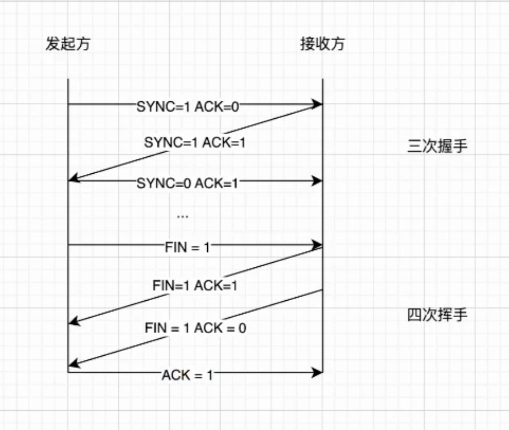
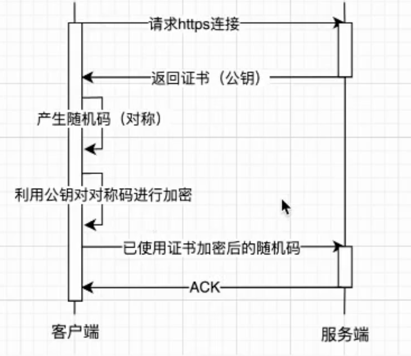

#

## 性能优化

### 面试题：从输入url到页面展示，中间经历了什么

- 输入url -资源定位符

- <http://www.baidu.com> - http协议
- 追问 http 和 TCP
  - 1. http -应用层 < = > TCP -传输层
  - 2. 关联 - http 基于 TCP实现连接 < = > UDP
- 追问：三次握手 - 四次挥手
- 如图



- 三次握手
  - 1. 客户端发送请求 - SYN
  - 2. 服务端接收请求 - SYN + ACK
  - 3. 客户端接收请求 - ACK
- 四次挥手
  - 1. 客户端发送请求 - FIN
  - 2. 服务端接收请求 - ACK
  - 3. 服务端发送请求 - FIN
  - 4. 客户端接收请求 - ACK

#### 由此得来第一步优化 - 减少http请求次数

- 优化点 http 1.0 => http 1.1 => http 2.0 优缺点

  - 1. http 1.0 => 1.1 - 复用连接（持久连接 -connection:keep-alive）、队头拦截
  - 2. http 1.1 => 2.0 - 多路复用、头部压缩、服务器推送

#### 追问：http 和 https

- https = http + ssl => 位于TCP协议和应用层之间



##### 问题：安全性连接导致了性能的下降，如何解决？

- 合并请求 => 减少请求次数
- 长连接 => 复用连接

### 域名解析

  域名 => ip

- 切HOST => 浏览器缓存 => 系统缓存 => 路由器缓存 => 运营商 => 根域名服务器
- 实际静态文件存放
  - 1. 多IP地址、LB（负载均衡）、云服务
  - 2. CDN
  - 3. 缓存 - 浏览器缓存、强缓存、协商缓存

#### *代码中的优化 - 手写并发控制QPS

```js
    // 输入 max 最大并发数
    // 存储 reqpool -并发池
    // 思路 执行 => 回调 - 塞入并发池
    class LimitPromise{
        constructor(max){
            // 异步并发上限
            this.max = max || 6
            // 当前执行任务数量
            this._count = 0
            // 等待执行任务队列
            this._taskQueue = []
           
        }
        // 任务执行
        run(caller){
            //主入口
            // 输入：外部要添加的请求任务
            // 输出：返回一个promise
            return new Promise((resolve, reject) => {
                // 创建处理任务
                let task = this._createTask(caller, resolve, reject)
                // 如果当前执行任务数量小于最大并发数，直接执行
                if(this._count >= this.max){
                    // 如果当前执行任务数量大于最大并发数，将任务添加到队列中
                    this._taskQueue.push(task)
                }else{
                    task()
                }
            })
            // 维护当前执行任务数量
            this._count++
        }

        _createTask(caller, resolve, reject){
           return ()=>{
               // 执行任务
               caller().then(res=>{
                resolve(res)
              }).catch(err=>{
                reject(err)
              }).finally(()=>{
                // 执行完成，当前执行数减一
                this._count--
                // 如果队列中还有任务，继续执行
                if(this._taskQueue.length){
                    let task = this._taskQueue.shift()
                    task()
                }
           })
           }
        }
         // 实例 单例模式
        static instance = null
        static getInstance(max){
            if(!this.instance){
                this.instance = new LimitPromise(max)
            }
            return this.instance
        }
    }

    // 使用
    const limitPromise = LimitPromise.getInstance(6)
    for(let i = 0; i < 100; i++){
        limitPromise.run(()=>{
            return new Promise((resolve, reject)=>{
                setTimeout(()=>{
                    console.log(i)
                    resolve(i)
                }, 1000)
            })
        }).then(res=>{
            console.log(res)
        })
    }

    // 追问 => 节流 防抖
```

### 编译 渲染

打包优化 => 压缩、分割、懒加载、预加载 => 工程化
渲染 => 浏览器原理 => 避免重绘重排 => 优化css、js、图片 => 优化渲染

### 内存优化

- 内存分配 - 及时释放
- 数据空间 - 优化数据结构 - 减少内存占用
  - 1. 对象 => 扁平化、深拷贝、避免循环引用
  - 2. 闭包 => 回收
- mark-sweep、v8垃圾回收机制 => 触达标记
