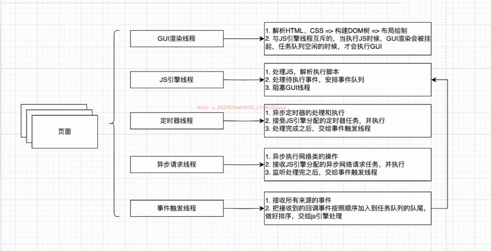
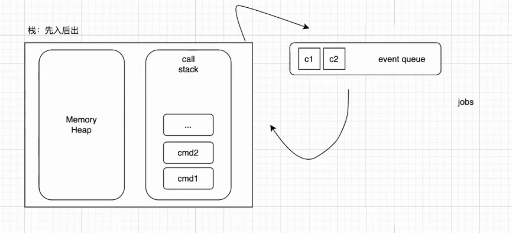
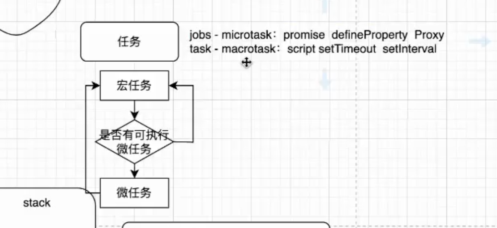

#

## 异步

### 异步是什么

```js
    let count = 1
    let timer = setTimeOut(()>{
        count ++ 
        console.log('in', count)
    })

    console.log('out' ,count)
    //  持续的动作
    // 看不见的队列 ，等待执行的任务
```

## 线程 & 进程

### 线程

- 线程是操作系统能够进行运算调度的最小单位
- 一个进程可以包括多个线程
- 线程是进程的一部分，是进程中的一个实体，是被系统独立调度和分派的基本单位
- 线程自己基本上不拥有系统资源，只拥有一点在运行中必不可少的资源，但是它可与同属一个进程的其他线程共享进程所拥有的全部资源

### 进程

- 进程是操作系统进行资源分配和调度的一个独立单位
- 每个进程都有自己的独立内存空间，不同进程通过进程间通信来通信
- 进程是程序的一次执行过程，是系统运行程序的基本单位

#### 面试题

- 浏览器新开一个标签页，是一个新的进程还是线程？ 一个新的进程
- 发散方向：
方式一：窗口（进程）间通信 -storage、cookie => 多种存储的区别 => 回归项目中的应用（做了什么）
方式二：浏览器原理

#### 浏览器原理

- GUI渲染线程
- JS引擎线程
- 定时器线程
- 异步http请求线程
- 事件触发线程



##### Event Loop



- 任务队列
- 宏任务 script setTimeout setInterval
- 微任务 promise definePorperty Proxy
- 宏任务执行完会触发页面渲染，微任务不会



```js
    setTimeout(() => {
        console.log('timeout')                 // 宏任务
    }, 0)
    new Promise((resolve, reject) => {
        console.log('promise')                 // 同步
        resolve()
    }).then(() => {
        console.log('then')                    // 微任务
    }).then(() => {
        console.log('then then')               // 微任务
    })
    console.log('end')                         // 同步
    // promise
    // end
    // then
    // then then
    // timeout
```

### promise

- 1. promise原理
状态：
主- pending 等待 fulfilled 成功 rejected 失败
executor 执行器 立即执行部分 | 接收两个参数 resolve reject

默认态 + 状态流转
默认态：pending
流转：pending => fulfilled | pending => rejected

返回值：
then -接收onFulfilled onRejected两个参数 | value or reason

- 2. 手写

```js
    const PENDING = 'PENDING'
    const FULFILLED = 'FULFILLED'
    const REJECTED = 'REJECTED'

    class Promise {
        constructor(executor){
            //1.默认状态
            //2.维护内部成功失败的值
            //3.维护成功失败的回调
            //成功的回调
            //失败的回调
        }
    }
```
