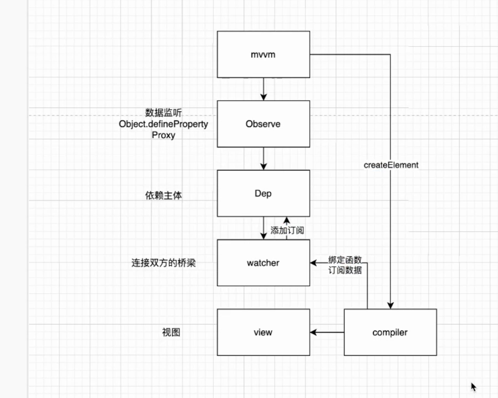
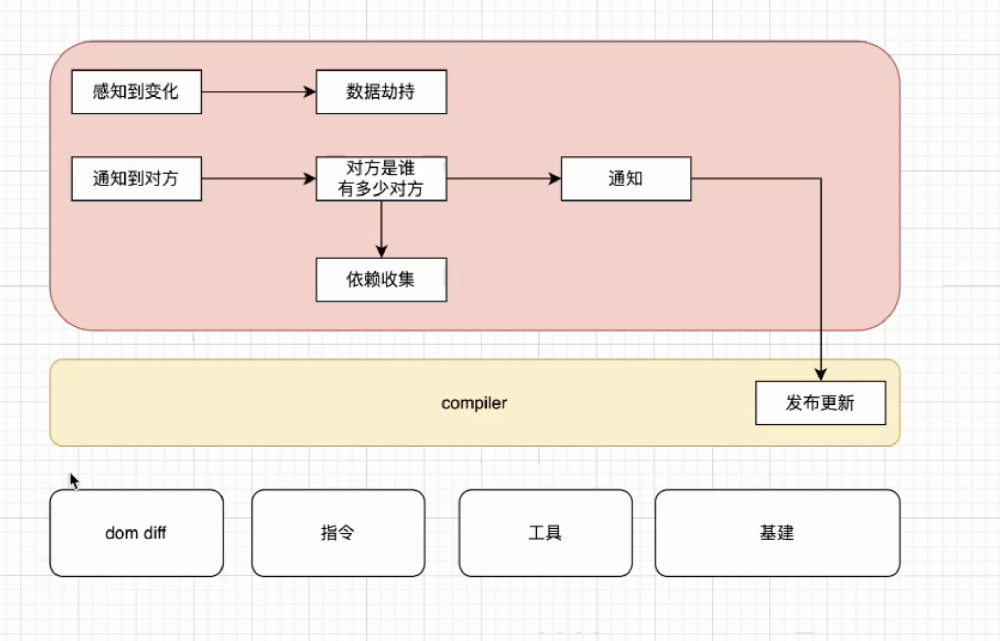

# vue源码解读

- 读源码步骤
- 找入口 => package.json => src => runtime-core => index.ts
- initGlobalAPI => initMixin => initExtend => initAssetRegisters => initUse => initMixin (挂载全局钩子)

## vue原理

## 数据劫持

- 感知数据变化 => 数据劫持
- 通知到对方 => 对方是谁？ => 依赖收集 => 通知 => 触发更新

### 依赖收集
